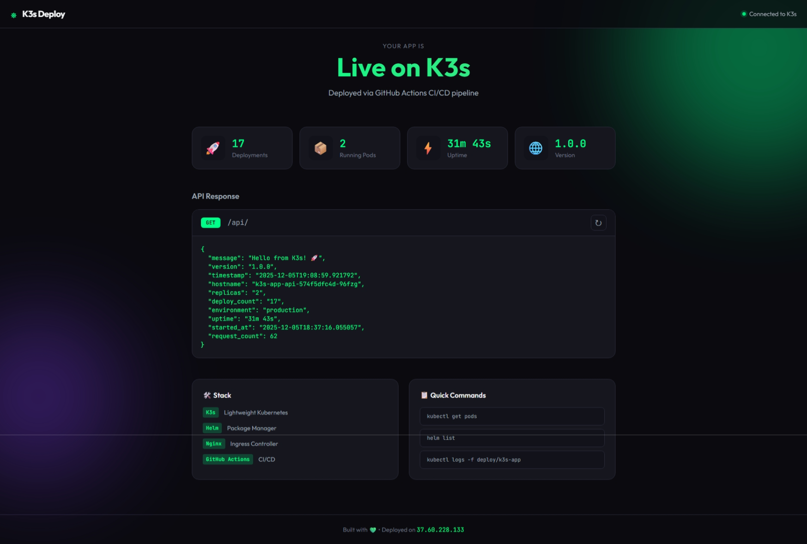
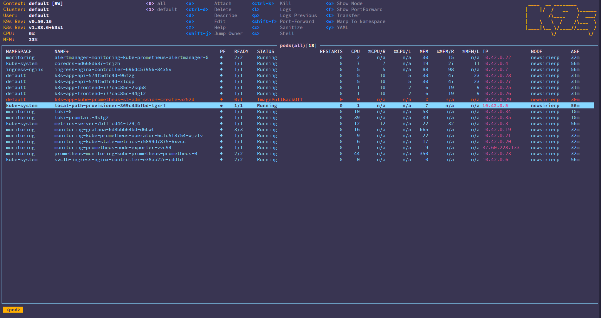
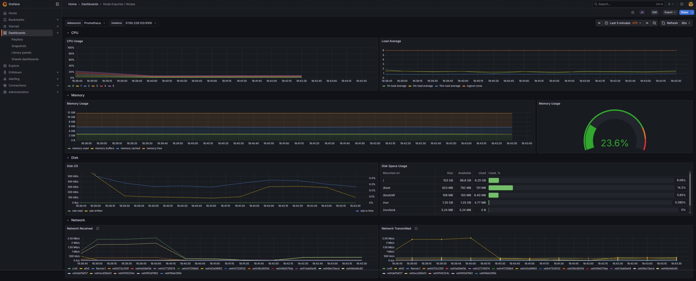
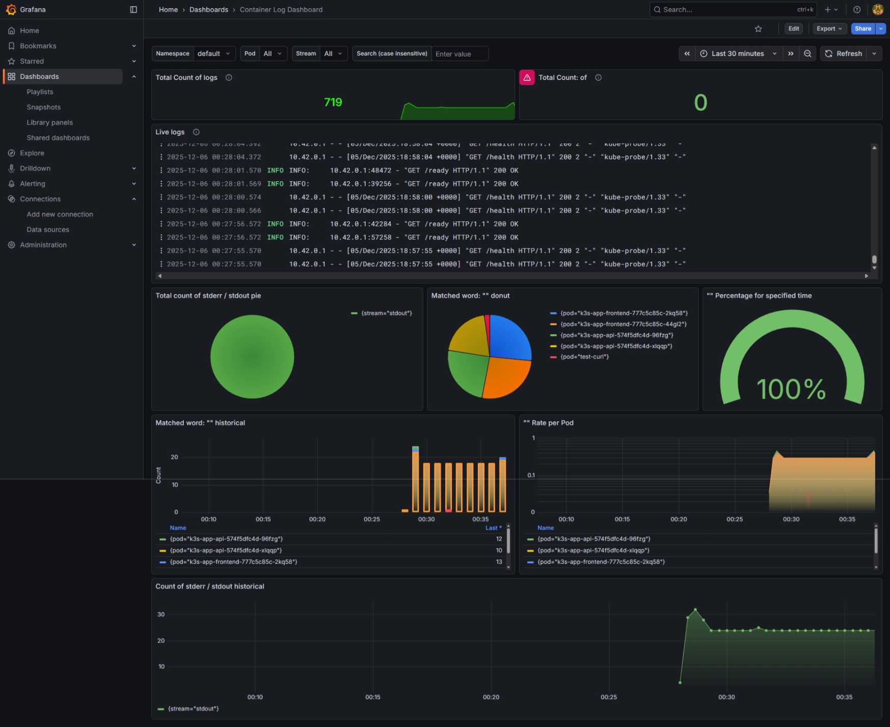

# K3s CI/CD Demo

A complete Kubernetes deployment setup with automated CI/CD using GitHub Actions, Helm, and full observability stack.


---

## Screenshots

### Application Dashboard


### K9s Terminal UI


### Grafana - Prometheus Metrics


### Grafana - Loki Logs


---

## Architecture

```
+-------------------------------------------------------------+
|                      VPS (K3s Cluster)                      |
|  +-------------------------------------------------------+  |
|  |              Nginx Ingress Controller                 |  |
|  +-----------------------+-------------------------------+  |
|                          |                                  |
|         +----------------+----------------+                 |
|         | /                               | /api/*          |
|         v                                 v                 |
|  +--------------+              +--------------+             |
|  |   Frontend   |              |     API      |             |
|  |   (Nginx)    |--------------+  (FastAPI)   |             |
|  |  Tailwind    |    proxy     |   Python     |             |
|  +--------------+              +--------------+             |
|                                                             |
|  +-------------------------------------------------------+  |
|  |              Observability Stack                      |  |
|  |  Prometheus | Grafana | Loki | Promtail               |  |
|  +-------------------------------------------------------+  |
+-------------------------------------------------------------+
```

---

## Features

- **Automated CI/CD** - Push to deploy via GitHub Actions
- **Helm Charts** - Templated Kubernetes deployments
- **Nginx Ingress** - Load balancing and routing
- **Prometheus** - Metrics collection
- **Grafana** - Beautiful dashboards
- **Loki** - Log aggregation
- **Tailwind CSS** - Modern UI
- **FastAPI** - High-performance Python API
- **GHCR** - GitHub Container Registry

---

## Quick Start

### 1. Setup VPS

```bash
# SSH into your VPS
ssh root@your-vps-ip

# Install K3s (without traefik)
curl -sfL https://get.k3s.io | sh -s - --disable traefik

# Install Nginx Ingress
helm repo add ingress-nginx https://kubernetes.github.io/ingress-nginx
helm install ingress-nginx ingress-nginx/ingress-nginx \
  --namespace ingress-nginx --create-namespace

# Get kubeconfig for GitHub Actions
sudo cat /etc/rancher/k3s/k3s.yaml | sed 's/127.0.0.1/YOUR_VPS_IP/g' | base64 -w 0
```

### 2. Configure GitHub

1. Fork/clone this repository
2. Add secret `KUBECONFIG` with the base64 value from step 1
3. Make GitHub packages public after first push

### 3. Deploy

```bash
git push origin main
```

GitHub Actions will build and deploy automatically.

---

## Project Structure

```
k3s/
├── .github/workflows/
│   └── deploy.yaml          # CI/CD pipeline
├── app/
│   ├── api/                  # FastAPI backend
│   │   ├── Dockerfile
│   │   ├── main.py
│   │   └── requirements.txt
│   └── frontend/             # Nginx frontend
│       ├── Dockerfile
│       ├── nginx.conf
│       └── index.html        # Tailwind CSS
├── helm/k3s-app/
│   ├── Chart.yaml            # Helm chart
│   ├── values.yaml           # Configuration
│   └── templates/            # K8s manifests
├── scripts/
│   └── setup-k3s.sh          # VPS setup script
├── img/                      # Screenshots
├── README.md
└── SETUP.md                  # Detailed setup guide
```

---

## Configuration

### Scale Replicas

Edit `helm/k3s-app/values.yaml`:

```yaml
frontend:
  replicaCount: 3

api:
  replicaCount: 3
```

### Environment Variables

```yaml
api:
  env:
    APP_VERSION: "2.0.0"
    DATABASE_URL: "postgres://..."
```

---

## Monitoring Stack

### Install Prometheus + Grafana

```bash
helm install monitoring prometheus-community/kube-prometheus-stack \
  --namespace monitoring --create-namespace \
  --set grafana.service.type=NodePort \
  --set grafana.service.nodePort=30030 \
  --set prometheus.service.type=NodePort \
  --set prometheus.service.nodePort=30090 \
  --set grafana.adminPassword=admin123
```

### Install Loki (Logs)

```bash
helm install loki grafana/loki-stack \
  --namespace monitoring \
  --set grafana.enabled=false \
  --set promtail.enabled=true
```

### Access

| Service | URL | Credentials |
|---------|-----|-------------|
| Grafana | `http://YOUR_IP:30030` | admin / admin123 |
| Prometheus | `http://YOUR_IP:30090` | - |

---

## Useful Commands

```bash
# Check pods
kubectl get pods

# View logs
kubectl logs -f deployment/k3s-app-api

# Restart deployment
kubectl rollout restart deployment/k3s-app-frontend

# Helm status
helm list

# K9s (terminal UI)
k9s
```

---

## Documentation

See [SETUP.md](SETUP.md) for detailed setup instructions including:
- Manual VPS setup
- SSL/TLS with Let's Encrypt
- Troubleshooting guide
- Monitoring setup

---

## Contributing

1. Fork the repository
2. Create your feature branch (`git checkout -b feature/amazing`)
3. Commit changes (`git commit -m 'Add amazing feature'`)
4. Push to branch (`git push origin feature/amazing`)
5. Open a Pull Request

---

## License

MIT License - feel free to use this project for your own deployments.

---

## Acknowledgments

- [K3s](https://k3s.io/) - Lightweight Kubernetes
- [Helm](https://helm.sh/) - Kubernetes package manager
- [Prometheus](https://prometheus.io/) - Monitoring
- [Grafana](https://grafana.com/) - Visualization
- [Loki](https://grafana.com/oss/loki/) - Log aggregation
